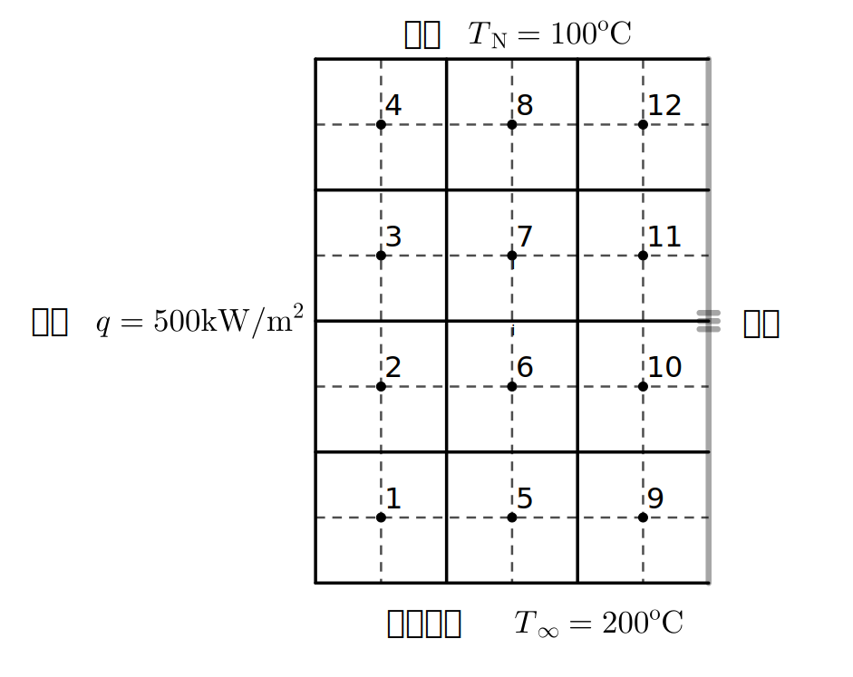

# 二维稳态扩散有限体积法

Two-dimensional steady-state diffusion finite volume method（2D SS Diffusion FVM）

## 1. INTRODUCE

取一平面控制体，$x$ 方向上场量 $\varphi$ 变化

$$\begin{align}
&\Bigg[\Gamma_x(-\frac{\partial\varphi}{\partial x}\Big\rvert_x)-\Gamma_{x+\Delta x}(-\frac{\partial\varphi}{\partial x}\Big\rvert_{x+\Delta x})\Bigg]\Delta y
=\frac{\partial}{\partial x}(\Gamma\frac{\partial \varphi}{\partial x})\Delta x\Delta y
\end{align}\tag{1}$$

$y$ 方向上场量 $\varphi$ 变化

$$\begin{align}
&\Bigg[\Gamma_y(-\frac{\partial\varphi}{\partial y}\Big\rvert_y)-\Gamma_{y+\Delta y}(-\frac{\partial\varphi}{\partial y}\Big\rvert_{y+\Delta y})\Bigg]\Delta x
=\frac{\partial}{\partial y}(\Gamma\frac{\partial \varphi}{\partial y})\Delta x\Delta y
\end{align}\tag{2}$$

场量守恒

$$\frac{\partial}{\partial x}\Big[\Gamma\frac{\partial \varphi}{\partial x}\Big]\Delta x\Delta y+\frac{\partial}{\partial y}\Big[\Gamma\frac{\partial \varphi}{\partial y}\Big]\Delta x\Delta y+S\Delta x\Delta y=0\tag{3}$$

化简得到二维稳态扩散问题的控制微分方程

$$\frac{\partial}{\partial x}\Big[\Gamma\frac{\partial \varphi}{\partial x}\Big]+
\frac{\partial}{\partial y}\Big[\Gamma\frac{\partial \varphi}{\partial y}\Big]+S=0\tag{3}$$

## 2. 生成离散网格

## 3. 构造离散方程

式（3）积分后利用高斯散度定理有

$$
\int_{\Delta V}\frac{\partial}{\partial x}\Big[\Gamma\frac{\partial \varphi}{\partial x}\Big]\mathrm{d}V
+\int_{\Delta V}\frac{\partial}{\partial y}\Big[\Gamma\frac{\partial \varphi}{\partial y}\Big]\mathrm{d}V
+\int_{\Delta V}S\mathrm{d}V=0\\
$$

即

$$
\Bigg[\Gamma_eA_e(\frac{\partial\varphi}{\partial x})_e-\Gamma_wA_w(\frac{\partial\varphi}{\partial y})_w\Bigg]
+\Bigg[\Gamma_nA_n(\frac{\partial\varphi}{\partial x})_n-\Gamma_sA_s(\frac{\partial\varphi}{\partial y})_s\Bigg]
+\overline{S}~\Delta V=0
\tag{4}$$

线性差值近似场变量和扩散率

$$\begin{align}
&\Gamma_eA_e(\frac{\partial\varphi}{\partial x})_e=\frac{\Gamma_P +\Gamma_E}{2}A_e\frac{\varphi_E -\varphi_P}{\delta x_{PE}}\tag{5-a}\\
&\Gamma_wA_w(\frac{\partial\varphi}{\partial x})_w=\frac{\Gamma_W +\Gamma_P}{2}A_w\frac{\varphi_P -\varphi_W}{\delta x_{WP}}\tag{5-b}\\
&\Gamma_nA_n(\frac{\partial\varphi}{\partial y})_n=\frac{\Gamma_N +\Gamma_P}{2}A_n\frac{\varphi_N -\varphi_P}{\delta y_{NP}}\tag{5-c}\\
&\Gamma_sA_s(\frac{\partial\varphi}{\partial y})_s=\frac{\Gamma_P +\Gamma_S}{2}A_s\frac{\varphi_P -\varphi_S}{\delta y_{SP}}\tag{5-d}
\end{align}$$

式（5）代入（4）有

$$\begin{align}
\Bigg[\frac{\Gamma_P +\Gamma_E}{2}A_e\frac{\varphi_E -\varphi_P}{\delta x_{PE}}-\frac{\Gamma_W +\Gamma_P}{2}A_w\frac{\varphi_P -\varphi_W}{\delta x_{WP}}\Bigg]+\\
\Bigg[\frac{\Gamma_N +\Gamma_P}{2}A_n\frac{\varphi_N -\varphi_P}{\delta y_{NP}}-\frac{\Gamma_P +\Gamma_S}{2}A_s\frac{\varphi_P -\varphi_S}{\delta y_{SP}}\Bigg]+\overline{S}~\Delta V=0\tag{6}
\end{align}$$

当 $\Gamma$ 为常数时

$$\begin{align}\Bigg[
\Gamma_e A_e\frac{\varphi_E -\varphi_P}{\delta x_{PE}}-
\Gamma_w A_w\frac{\varphi_P -\varphi_W}{\delta x_{WP}}
\Bigg]+\\ \Bigg[
\Gamma_n A_n\frac{\varphi_N -\varphi_P}{\delta y_{NP}}-
\Gamma_s A_s\frac{\varphi_P -\varphi_S}{\delta y_{SP}}
\Bigg]+\overline{S}~\Delta V=0\end{align}\tag{7}$$

源项线性化并按节点变量整理

$$\begin{align}(\frac{\Gamma_e A_e}{\delta x_{PE}}+\frac{\Gamma_w A_w}{\delta x_{WP}}+\frac{\Gamma_n A_n}{\delta x_{PN}}+\frac{\Gamma_s A_s}{\delta x_{SP}}-S_p)\varphi_P=\\
\frac{\Gamma_e A_e}{\delta x_{PE}}\varphi_E+\frac{\Gamma_w A_w}{\delta x_{WP}}\varphi_w+\frac{\Gamma_n A_n}{\delta x_{PN}}\varphi_N+\frac{\Gamma_s A_s}{\delta x_{SP}}\varphi_S+S_u\end{align}\tag{8}
$$

各项系数简写并归一化处理

$$a_P\varphi_P=a_E\varphi_E+a_W\varphi_W+a_N\varphi_N+a_S\varphi_S+S_u\tag{9}$$

其中

$$\begin{align}a_E &= \frac{\Gamma_e A_e}{\delta x_{PE}},~~
a_W=\frac{\Gamma_w A_w}{\delta x_{WP}},~~
a_N=\frac{\Gamma_n A_n}{\delta x_{PN}},~~
a_S=\frac{\Gamma_s A_s}{\delta x_{SP}},\\
a_P &= a_E+a_W+a_N+a_S-S_P\tag{10}
\end{align}$$

式（10）适用于求解域内所有控制体。

## 示例 1. 恒导热系数二维稳态扩散问题求解

!!! question
    二维受热平板，板长 $L=0.3\mathrm{m}$，高 $H=0.4\mathrm{m}$ ，厚 $0.01\mathrm{m}$ ，导热系数 $k=1000~\mathrm{W/(m\cdot K)}$，西侧边界有稳定热流输入，热流密度 $q=500~\mathrm{kW/m^2}$， 东侧边界绝热，南侧边界与外界温度 $T=200\mathrm{^o C}$的空气对流换热，对流换热系数 $h=253.165~\mathrm{W/(m^2\cdot K)}$ ，北侧边界保持常温，$T=100\mathrm{^o C}$. 求板内温度分布。

二维无热源导热控制方程，令式（3）中方程场量为温度 $T$ ，无源项令 $S=0$，有

$$\frac{\partial}{\partial x}\Big[k\frac{\partial T}{\partial x}\Big]+
\frac{\partial}{\partial y}\Big[k\frac{\partial T}{\partial y}\Big]=0\tag{12}$$

边界条件

$$\begin{align}
&-k\frac{\partial T}{\partial x}\Big\rvert_{x=0}=500~000~,~
-k\frac{\partial T}{\partial x}\Big\rvert_{x=L}=0\\
&k\frac{\partial T}{\partial x}\Big\rvert_{y=0}=h(T_{y}-T_{\infty})~,~T_N=100
\end{align}$$

下图划分均匀网格，$\Delta x=\Delta y=0.1$。

场内无热源，依式（9）除边界节点外即节点6、7有离散方程

$$a_PT_P=a_WT_W+a_ET_E+a_ST_S+a_NT_N\tag{13}$$

其中

$$a_W=\frac{k}{\delta x}A_w~,~a_E = \frac{k}{\delta x}A_e~,~a_S=\frac{k}{\delta y}A_s~,~a_N=\frac{k}{\delta y}A_n$$

边界节点有如下

