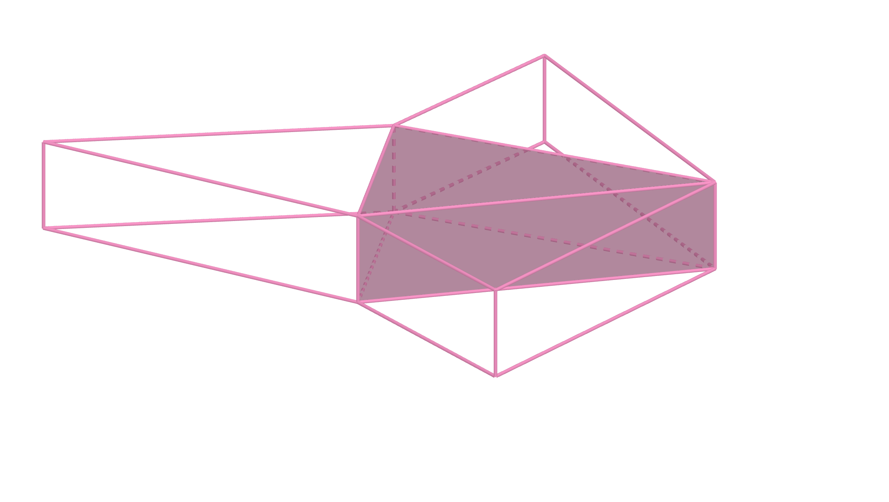

# 二维非均匀三角网格-非稳态扩散偏微分方程

## 1. INTRODUCE

二维非稳态问题的控制微分方程

$$\frac{\partial C}{\partial t}=
\mathbf{Div}\Big[k\mathbf{Grad}(C)\Big]+S$$

## 2. 方程离散

各项积分

$$\int_t^{t+\Delta t}\mathrm{d}t\int_{\Delta V}\frac{\partial C}{\partial t}\mathrm{d}V=
\int_t^{t+\Delta t}\mathrm{d}t\int_{\Delta V}\mathbf{Div}\Big[k\mathbf{Grad}(C)\Big]\mathrm{d}V+
\int_t^{t+\Delta t}\mathrm{d}t\int_{\Delta V}S\mathrm{d}V$$

### 时间项

$$
\int_t^{t+\Delta t}\mathrm{d}t\int_{\Delta V}\frac{\partial C}{\partial t}\mathrm{d}V=(C_P-C_P^0)\Delta V
$$

### 扩散项

高斯散度定理

$$\begin{align}
\int_t^{t+\Delta t}\mathrm{d}t\int_{\Delta V}\mathbf{Div}\Big[k\mathbf{Grad}(C)\Big]\mathrm{d}V=
\int_t^{t+\Delta t}\mathrm{d}t\int_A \boldsymbol{n}\cdot k~\mathbf{Grad}(C)\mathrm{d}A\\
=\sum_{i=1}^{3}\int_t^{t+\Delta t}\mathrm{d}t\int_{A_i} \boldsymbol{n_1}\cdot k~\mathbf{Grad}(C)_i \mathrm{d}A_i
\end{align}$$

其中

$$\begin{align}
\int_t^{t+\Delta t}\mathrm{d}t\int_{A_i} \boldsymbol{n_1}\cdot k~\mathbf{Grad}(C)_i \mathrm{d}A_i=
\int_t^{t+\Delta t}\boldsymbol{n_1}\cdot\boldsymbol{n_i}\cdot kA_i~\frac{C_i-C_P}{\delta_i} \mathrm{d}t\\
=\int_t^{t+\Delta t}\boldsymbol{n_1}\cdot \boldsymbol{n_i}\cdot kA_i~\frac{C_i}{\delta_i}\mathrm{d}t-
\int_t^{t+\Delta t}\boldsymbol{n_1}\cdot\boldsymbol{n_i}\cdot kA_i~\frac{C_P}{\delta_i}\mathrm{d}t
\end{align}$$

不同时间的场变量值加权组合近似时间间隔内的平均温度

$$\begin{align}
\int_t^{t+\Delta t}\boldsymbol{n_1}\cdot\boldsymbol{n_i}\cdot kA_i~\frac{C}{\delta_i}\mathrm{d}t=\boldsymbol{n_1}\cdot\boldsymbol{n_i}\cdot kA_i\Big[\theta C+(1-\theta )C^0\Big]\frac{\Delta t}{\delta_i}
\end{align}$$

加权因子 $\theta$ 的不同可分为三类，

1. $\theta =0$ ，显式计算格式
2. $0<\theta \leqslant 1$ ，隐式计算格式，当 $\theta =1$ 时称全隐式计算格式
3. $\theta =0.5$ ，Crank-Nicolson（C-N）格式

所以有

$$\int_t^{t+\Delta t}\mathrm{d}t\int_{A_i} \boldsymbol{n_1}\cdot k~\mathbf{Grad}(C)_i \mathrm{d}A_i=
\boldsymbol{n_1}\cdot\boldsymbol{n_i}\cdot kA_i\Big[\theta(C_i-C_P)+(1-\theta )(C_i^0-C_P^0)\Big]\frac{\Delta t}{\delta_i}$$
### 源项

$$\int_t^{t+\Delta t}\mathrm{d}t\int_{\Delta V}S\mathrm{d}V=S\Delta V \Delta t$$

### 合并

$$(C_P-C_P^0)\Delta V=
\sum_{i=1}^3\boldsymbol{n_1}\cdot\boldsymbol{n_i}\cdot kA_i\Big[\theta(C_i-C_P)+(1-\theta )(C_i^0-C_P^0)\Big]\frac{\Delta t}{\delta_i}+S\Delta V \Delta t$$

二维空间简化高相等

$$(C_P-C_P^0)\frac{A}{\Delta t}=
\sum_{i=1}^3\boldsymbol{n_1}\cdot\boldsymbol{n_i}\cdot \frac{ka_i}{\delta_i}\Big[\theta(C_i-C_P)+(1-\theta )(C_i^0-C_P^0)\Big]+SA$$

得到二维非均匀三角网格的离散方程，其中
$A$ 为控制体面积，$\delta_i$ 为控制点质心（重心，即中线交点）距离，$a_i$ 为三角形边长。

假设为显式计算格式，按节点整理

$$\frac{A}{\Delta t}C_P=
\sum_{i=1}^3\boldsymbol{n_1}\cdot\boldsymbol{n_i}\cdot \frac{ka_i}{\delta_i} C_i^0-
\Big(\sum_{i=1}^3\boldsymbol{n_1}\cdot\boldsymbol{n_i}\cdot \frac{ka_i}{\delta_i}-\frac{A}{\Delta t}\Big)C_P^0
+SA$$