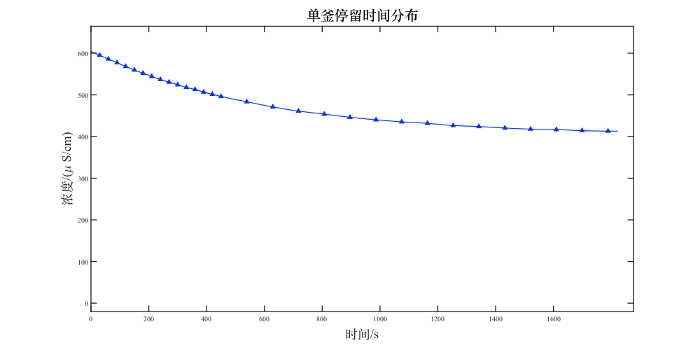
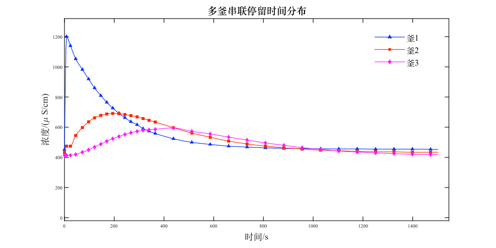

`2024-12-07`

---

## 源码

运行代码会在目录下生成图片和README文件。

注意将数据写入同目录下。

[github地址](https://github.com/hhlans/INFO/tree/main/data)。

??? success "1_0.csv"
    ``` matlab linenums="1"
    i     T(s)     σ (μS/cm)  
    1     0005.0   418.5528   
    2     0010.0   418.4918   
    3     0016.0   417.0880   
    4     0022.0   417.4237   
    5     0028.0   418.5223   
    6     0033.0   418.4918   
    7     0039.0   416.0198   
    8     0045.0   415.9588   
    9     0050.0   414.7381   
    10    0056.0   403.9042   
    11    0062.0   403.9042   
    12    0067.0   401.2491   
    13    0073.0   398.7161   
    14    0079.0   399.8148   
    15    0084.0   397.3123   
    16    0103     436.2838   
    17    0122     642.4637   
    18    0140     881.3589   
    19    0159     716.5920   
    20    0178     531.2560   
    21    0196     459.1724   
    22    0215     430.1192   
    23    0234     424.6870   
    24    0252     415.9893   
    25    0271     413.6394   
    26    0290     415.8672   
    27    0308     412.3882   
    28    0327     411.2285   
    29    0346     411.1370   
    30    0364     411.1370 
    ```

??? success "1_3.csv"
    ```matlab linenums="1"
    1     0013.0   471.9289
    2     0026.0   471.8984
    3     0039.0   924.9998
    4     0052.0   786.1732
    5     0065.0   523.7485
    6     0078.0   485.5399
    7     0091.0   587.0125
    8     0101.0   716.7751
    9     0117.0   613.8988
    10    0130.0   521.0629
    11    0143.0   533.7889
    12    0156.0   607.3069
    13    0169.0   602.5767
    14    0182.0   548.7123
    15    0195.0   522.4303
    16    0235.0   547.1611
    17    0276.0   537.2375
    18    0317.0   512.3653
    19    0357.0   510.6868
    20    0398.0   506.1396
    21    0438.0   484.6241
    22    0479.0   479.5889
    23    0519.0   474.5840
    24    0560.0   469.2433
    25    0600.0   467.9921
    26    0641.0   464.3604
    27    0682.0   461.7664
    28    0722.0   461.7664
    29    0763.0   459.2944
    30    0803.0   459.3555
    ```

??? success "1_5.csv"
    ```matlab linenums="1"
    0  0  456.6393
    1    0012.0   469.0907
    2    0024.0   493.8409
    3    0036.0   799.2044
    4    0048.0   521.3681
    5    0061.0   516.2716
    6    0073.0   707.6503
    7    0085.0   546.5150
    8    0097.0   537.5427
    9    0109.0   642.7689
    10   0121.0   554.0225
    11   0134.0   531.2865
    12   0146.0   598.4872
    13   0158.0   564.0934
    14   0170.0   531.4391
    15   0182.0   566.7790
    16   0219.0   545.2637
    17   0255.0   527.3497
    18   0292.0   517.4618
    19   0328.0   506.2617
    20   0365.0   500.0055
    21   0401.0   493.7493
    22   0438.0   488.5612
    23   0474.0   484.8990
    24   0511.0   481.0233
    25   0547.0   478.3682
    26   0584.0   474.6450
    27   0620.0   472.0815
    28   0657.0   470.7997
    29   0693.0   468.1141
    30   0730.0   465.4591
    ```

??? success "2_1.csv"
    ```matlab linenums="1"
    1     0030.0   595.0692
    2     0060.0   586.0359
    3     0090.0   577.1551
    4     0120.0   568.2438
    5     0150.0   559.5462
    6     0180.0   551.9167
    7     0210.0   544.2872
    8     0240.0   536.8102
    9     0270.0   530.4930
    10    0300.0   524.1758
    11    0330.0   517.9806
    12    0360.0   512.8841
    13    0390.0   506.5058
    14    0420.0   501.4398
    15    0450.0   496.1907
    16    0539.0   483.4647
    17    0629.0   470.9523
    18    0718.0   461.1866
    19    0807.0   453.7707
    20    0896.0   446.1717
    21    0986.0   440.1596
    22    1075.0   435.2767
    23    1164.0   431.5535
    24    1253.0   426.4265
    25    1342.0   423.9545
    26    1432.0   420.3839
    27    1521.0   417.7899
    28    1610.0   416.5997
    29    1699.0   414.1277
    30    1789.0   412.9680
    ```

??? success "2_3.csv"
    ```matlab linenums="1"
    0 0 451.9091 432.4477 413.7340
    0 8 1200   4.7420e+02  4.1373e+02
    1.0000e+00  2.4000e+01  1.1397e+03  4.7420e+02  4.1373e+02
    2.0000e+00  4.5000e+01  1.0527e+03  5.4508e+02  4.1917e+02
    3.0000e+00  7.2000e+01  9.8207e+02  5.9741e+02  4.3403e+02
    4.0000e+00  9.7000e+01  9.1923e+02  6.3525e+02  4.4974e+02
    5.0000e+00  1.2100e+02  8.6003e+02  6.6195e+02  4.6814e+02
    6.0000e+00  1.4600e+02  8.0921e+02  6.7772e+02  4.8759e+02
    7.0000e+00  1.7000e+02  7.6478e+02  6.8746e+02  5.0673e+02
    8.0000e+00  1.9400e+02  7.2663e+02  6.9114e+02  5.2363e+02
    9.0000e+00  2.1900e+02  6.9239e+02  6.8998e+02  5.3821e+02
    1.0000e+01  2.4300e+02  6.6285e+02  6.8395e+02  5.5189e+02
    1.1000e+01  2.6700e+02  6.3636e+02  6.7679e+02  5.6321e+02
    1.2000e+01  2.9200e+02  6.1622e+02  6.6824e+02  5.7230e+02
    1.3000e+01  3.1600e+02  5.9031e+02  6.5725e+02  5.7916e+02
    1.4000e+01  3.4000e+02  5.7349e+02  6.4537e+02  5.8246e+02
    1.5000e+01  3.6500e+02  5.5842e+02  6.3417e+02  5.8600e+02
    1.6000e+01  4.3800e+02  5.2350e+02  5.9634e+02  5.9488e+02
    1.7000e+01  5.1200e+02  4.9952e+02  5.6091e+02  5.7230e+02
    1.8000e+01  5.8600e+02  4.8588e+02  5.3317e+02  5.5535e+02
    1.9000e+01  6.6000e+02  4.7443e+02  5.0797e+02  5.3390e+02
    2.0000e+01  7.3400e+02  4.6833e+02  4.8895e+02  5.1478e+02
    2.1000e+01  8.0800e+02  4.6317e+02  4.7423e+02  4.9561e+02
    2.2000e+01  8.8200e+02  4.5936e+02  4.6344e+02  4.7990e+02
    2.3000e+01  9.5600e+02  4.5813e+02  4.5495e+02  4.6460e+02
    2.4000e+01  1.0300e+03  4.5694e+02  4.4767e+02  4.5340e+02
    2.5000e+01  1.1030e+03  4.5575e+02  4.4416e+02  4.4201e+02
    2.6000e+01  1.1770e+03  4.5572e+02  4.3920e+02  4.3505e+02
    2.7000e+01  1.2510e+03  4.5444e+02  4.3726e+02  4.2933e+02
    2.8000e+01  1.3250e+03  4.5447e+02  4.3641e+02  4.2489e+02
    2.9000e+01  1.3990e+03  4.5447e+02  4.3378e+02  4.2027e+02
    3.0000e+01  1.4720e+03  4.5319e+02  4.3378e+02  4.1813e+02
    ```

??? success "代码"
    ``` MATLAB linenums="1"
    clear, close all;
    global fp;
    fp = fo();
    yuchuli();
    %**********************************************************
    %**********************************************************
    %**********************************************************读取数据
    %*********************************************管式
    dt1_0 = readmatrix("1_0.csv");
    u1_0 = 410.5223;
    %u1_0 = min(min(dt1_0(:,3)), u1_0);

    dt1_3 = readmatrix("1_3.csv");
    u1_3 = min(min(dt1_3(:,3)), 471.8984);
    %u1_3 =  471.8984;
    dt1_5 = readmatrix("1_5.csv");
    u1_5 = min(dt1_5(:, 3),456.6393);
    u1_5 = 456.6393;
    f1 = @(x,name)fwtb(fp, name, [x(1:end/2,:),x(end/2+1:end,:)], {'$i$';'$t/s$';['$\\sigma/(\\mu S/cm)$'];'$i$';'$t$';['$\\sigma/(\\mu S/cm)$']},3);
    f1(dt1_0, '$\beta=0$ 单管停留时间分布');
    f1(dt1_3, '$\beta=3$ 单管停留时间分布');
    f1(dt1_5(2:end,:), '$\beta=5$ 单管停留时间分布');
    %*********************************************釜式
    dt2_1 = readmatrix("2_1.csv");
    u2_1 = min(min(dt2_1(:,3)),394.2910);
    u2_1 = 394.2910;
    dt2_3 = readmatrix("2_3.csv");
    u2_3 = [451.9091 432.4477 413.7340;min(dt2_3(:,3:5),[], 1)];
    u2_3 = u2_3(1, :);

    f1(dt2_1, '单釜停留时间分布');
    fwtb(fp, '多釜串联停留时间分布', dt2_3, {'$i$';'$t/s$';['$\\sigma/(\\mu S/cm)$'];['$\\sigma/(\\mu S/cm)$'];['$\\sigma/(\\mu S/cm)$']},3)

    %**********************************************************
    %**********************************************************
    %**********************************************************初绘图
    %*********************************************
    plot1(dt1_0(:, 2), dt1_0(:, 3), '\beta=0 单管停留时间分布','时间/s','浓度/(\mu S/cm)','fph', 'image1/');
    plot1(dt1_3(:, 2), dt1_3(:, 3), '\beta=3 单管停留时间分布','时间/s','浓度/(\mu S/cm)','fph', 'image1/');
    plot1(dt1_5(:, 2), dt1_5(:, 3), '\beta=5 单管停留时间分布','时间/s','浓度/(\mu S/cm)','fph', 'image1/');
    plot1(dt2_1(:, 2), dt2_1(:, 3), '单釜停留时间分布','时间/s','浓度/(\mu S/cm)','fph', 'image1/');
    plot1(dt2_3(:, 2), dt2_3(:, 3:5), '多釜串联停留时间分布','时间/s','浓度/(\mu S/cm)','leng',{'釜1', '釜2', '釜3'},'fph', 'image1/');
    %*********************************************釜式
    plot1(dt1_0(:, 2), dt1_0(:, 3)-u1_0, '\beta=0 单管停留时间分布(去基准)','时间/s','浓度/(\mu S/cm)','fph', 'image2/');
    plot1(dt1_3(:, 2), dt1_3(:, 3)-u1_3, '\beta=3 单管停留时间分布(去基准)','时间/s','浓度/(\mu S/cm)','fph', 'image2/');
    plot1(dt1_5(:, 2), dt1_5(:, 3)-u1_5, '\beta=5 单管停留时间分布(去基准)','时间/s','浓度/(\mu S/cm)','fph', 'image2/');
    plot1(dt2_1(:, 2), dt2_1(:, 3)-u2_1, '单釜停留时间分布(去基准)','时间/s','浓度/(\mu S/cm)','fph', 'image2/');
    plot1(dt2_3(:, 2), dt2_3(:, 3:5)-ones(size(dt2_3, 1),1)*u2_3, '多釜串联停留时间分布(去基准)','时间/s','浓度/(\mu S/cm)','leng',{'釜1', '釜2', '釜3'},'fph', 'image2/');

    %**********************************************************
    %**********************************************************
    %**********************************************************数值计算
    rets = ones(7, 14);
    rets(1,:) = inter(dt1_0(:, 2), dt1_0(:, 3)-u1_0);
    rets(2,:) = inter(dt1_3(:, 2), dt1_3(:, 3)-u1_3);
    rets(3,:) = inter(dt1_5(:, 2), dt1_5(:, 3)-u1_5);
    rets(4,:) = inter(dt2_1(:, 2), dt2_1(:, 3)-u2_1);
    rets(5,:) = inter(dt2_3(:, 2), dt2_3(:, 3)-u2_3(1));
    rets(6,:) = inter(dt2_3(:, 2), dt2_3(:, 4)-u2_3(2));
    rets(7,:) = inter(dt2_3(:, 2), dt2_3(:, 5)-u2_3(3));
    fwt(fp, '## 结果');
    fwtb(fp, '一阶差分', rets(:, 1:end/2), {'$\\int L(t)dt$';'$\\int tL(t)dt$';'$t$';'$\\int t^2L(t)dt$';'$\\sigma_{t}^2$';'$\\sigma_{\\theta}^2$';'$N$'},4);
    fwtb(fp, 'quadl', rets(:, end/2+1:end), {'$\\int L(t)dt$';'$\\int tL(t)dt$';'$t$';'$\\int t^2L(t)dt$';'$\\sigma_{t}^2$';'$\\sigma_{\\theta}^2$';'$N$'},4);

    %********************************************************%********************************************************函数区
    %**********************************************************
    %**********************************************************
    %**********************************************************数值积分
    function ret = inter(x, y)
        %一阶差分
        if size(x, 1)==1
            x = x';
        end
        if size(y, 1)==1
            y = y';
        end
        in2 = trapz(x, y);%ct
        in2t = trapz(x, y.*x);%tct
        in2t_ = in2t/in2;
        sig2 = trapz(x, y.*x.*x)/in2;
        sig2_ = sig2-in2t_*in2t_;
        tth2 = (sig2_)/(in2t_^2);

        pp = pchip(x, y);
        pv = @(px)ppval(pp, px);
        pvt = @(px)ppval(pp, px).*px;
        pvt2 = @(px)ppval(pp, px).*px.*px;

        in3 = quadl(pv, 0, max(x));%lt
        in3t = quadl(pvt, 0, max(x));%tlt
        in3t_ = in3t/in3;%t_
        sig3 = quadl(pvt2, 0, max(x))/in3;%t2lt
        sig3_ = sig3-in3t_*in3t_;%sigma
        tth3 = (sig3_)/(in3t_^2);
        ret = [in2, in2t,in2t_,sig2*in2,sig2_, tth2, 1/tth2,in3,in3t,in3t_,sig3*in3,sig3_,tth3,1/tth3];
    end


    %**********************************************************
    %**********************************************************
    %**********************************************************折线图绘制函数
    function plot1(x, y, name, xname, yname, varargin)
        ipa = inputParser;
        addParameter(ipa, 'leng', 0);
        addParameter(ipa, 'fph', 0);
        parse(ipa, varargin{:});
        leng = ipa.Results.leng;
        fph = ipa.Results.fph;
        p = figure('visible','off','Position', [0, 0, 1000, 500]);
        cm = [0.017,0.198,1;1,0.149,0;1, 0.1, 1;];%颜色rgb
        mark = ['^','s','d'];%scatter标记
        h_plot = [];
        h_scatter = [];
        paym=0;
        for i=1:size(y, 2)
            inter = (max(x)-min(x))/500;
            px1 = 0:inter:max(x)+10*inter;
            py1 = pchip(x, y(:,i), px1);
            h_plot(i)  = plot(px1, py1, 'linewidth',1.2,'color', cm(i, :));
            hold on;
            h_scatter(i) = scatter(x, y(:,i), 50,cm(i, :), mark(i), 'filled');
            h_legend(i) = plot(NaN, NaN, 'linewidth', 1.2, 'color', cm(i, :), ...
                    'Marker', mark(mod(i-1, length(mark)) + 1), 'MarkerSize', 6, ...
                    'MarkerFaceColor', cm(i, :));
            hold on;
            paym = max(max(py1), paym);
        end
        if  ~ismember('leng', ipa.UsingDefaults)
            lgd = legend(h_legend, leng, 'position', [0.75 0.75,0.1,0.1],'fontsize', 17,'box', 'off');
            lgd.ItemTokenSize = [60, 10];
        end
        intex = (max(x)-min(x))/20;
        intey = (paym-0)/10;
        %xlim([min(x)-intex,max(x)+intex])
        xlim([0,max(x)+intex])
        %ylim([min(min(y))-intey,max(max(y))+intey])
        ylim([-20,paym+intey])
        xticks(0:200:max(x))
        figFont3(p,name,xname,yname)
        if  ~ismember('fph', ipa.UsingDefaults)
            saveas(p, [fph ,name, '.svg']);
        end
    end

    function figFont3(fig, titlename, xname, yname)
        title(titlename ,'fontsize', 20)
        xlabel(xname,'fontsize', 18);
        ylabel(yname,'fontsize', 18);
        box on;
        set(gca, 'LineWidth', 1.4);
        allTextObjects = findall(fig, 'Type', 'text');
        for i = 1:length(allTextObjects)
            textObj = allTextObjects(i);
            originalString = textObj.String;
            modifiedString = stringChg(originalString);
            textObj.String = modifiedString;
        end
        allAxes = findall(fig, 'Type', 'axes');
        for i = 1:length(allAxes)
            ax = allAxes(i);
            if ~isempty(ax.XTickLabel)
                ax.XTickLabel = cellfun(@stringChg, ax.XTickLabel, 'UniformOutput', false);
            end
            if ~isempty(ax.YTickLabel)
                ax.YTickLabel = cellfun(@stringChg, ax.YTickLabel, 'UniformOutput', false);
            end
            if ~isempty(ax.ZTickLabel)
                ax.ZTickLabel = cellfun(@stringChg, ax.ZTickLabel, 'UniformOutput', false);
            end
        end
        allPolarAxes = findall(fig, 'Type', 'polaraxes');
        for i = 1:length(allPolarAxes)
            disp('Oreo');
            ax = allPolarAxes(i);
            if ~isempty(ax.RTickLabel)
                ax.RTickLabel = cellfun(@stringChg, ax.RTickLabel, 'UniformOutput', false);
            end
            if ~isempty(ax.ThetaTickLabel)
                ax.ThetaTickLabel = cellfun(@stringChg, ax.ThetaTickLabel, 'UniformOutput', false);
            end
        end
        allLegend=findall(fig,'Type','Legend');
        for i=1:length(allLegend)
            lg=allLegend(i);
            if ~isempty(lg.String)
                lg.String = cellfun(@stringChg,lg.String, 'UniformOutput', false);
            end
        end

    end

    function modifiedString = stringChg(textCont_String)
        if strcmp(textCont_String,char);modifiedString=char;else
            chiFontname = 'Songti SC';
            engFontname = 'Times New Roman';
            result = splitChinese(textCont_String);
            result.Data(result.flag == 1) = strcat(['\fontname{', chiFontname, '}'], result.Data(result.flag == 1));
            result.Data(result.flag == 0) = strcat(['\fontname{', engFontname, '}'], result.Data(result.flag == 0));
            modifiedString = [result.Data{:}];
        end
    end

    function result = splitChinese(label)
        label = char(label);
        log = arrayfun(@(x) (x >= '一' && x <= '龥') || ...
            (x >= 8212 && x <= 8230) || ...
            (x >= 12290 && x <= 12305) || ...
            (x >= 65281 && x <= 65311), label);
        Indxs = find(diff(log) ~= 0);
        result.Data = arrayfun(@(x, y) extractBetween(label, x, y), [0, Indxs]' + 1, [Indxs, length(label)]');
        result.flag = [log(Indxs), log(end)];
    end

    %**********************************************************
    %**********************************************************
    %**********************************************************文件读写
    function fw(file, title, data)
        fprintf(file, "### %s\n", title);
        for i=1:size(data, 1)
            fprintf(file, "    ");
            for j=1:size(data, 2)
                if data(i, j)>=0
                    fprintf(file, " ");
                end
                fprintf(file, "%.4f ", data(i, j));
            end
            fprintf(file, "\n");
        end
        fprintf(file, "\n");
    end

    function fw_(file, title, data)
        fprintf(file, "### %s\n", title);
        for i=1:size(data, 1)
            fprintf(file, "    ");
            for j=1:size(data, 2)
                if data(i, j)>=0
                    fprintf(file, " ");
                end
                fprintf(file, "%.4e ", data(i, j));
            end
            fprintf(file, "\n");
        end
        fprintf(file, "\n");
    end

    function fwtb_(file, title, data, head, ni)
        for i=1:ni
            fprintf(file, '#');
        end
        fprintf(file, " %s\n|", title);
        for i=1:size(head, 1)
            fprintf(file, [head(i, :),'|']);
        end
        fprintf(file, '\n|');
        for i=1:size(head, 1)
            fprintf(file, '-|');
        end
        fprintf(file, '\n');
        for i=1:size(data, 1)
            fprintf(file, "|");
            for j=1:size(data, 2)
                if data(i, j)>=0
                    fprintf(file, "");
                end
                fprintf(file, "%.4e|", data(i, j));
            end
            fprintf(file, "\n");
        end
        fprintf(file, "\n");
    end

    function fwtb(file, title, data, head, ni)
        for i=1:ni
            fprintf(file, '#');
        end
        fprintf(file, " %s\n|", title);
        for i=1:size(head, 1)
            str = strjoin(head(i));
            fprintf(file, [str,'|']);
        end
        fprintf(file, '\n|');
        for i=1:size(head, 1)
            fprintf(file, '-|');
        end
        fprintf(file, '\n');
        for i=1:size(data, 1)
            fprintf(file, "|");
            for j=1:size(data, 2)
                if data(i, j)>=0
                    fprintf(file, "");
                end
                fprintf(file, "%.4f|", data(i, j));
            end
            fprintf(file, "\n");
        end
        fprintf(file, "\n");
    end


    function yuchuli()
        global fp;
        fwt(fp, '## 图片\n\n\n');
        fwt(fp, '\n\n\n');
        fwt(fp, '.svg)\n.svg)\n.svg)\n');
        fwt(fp, '.svg)\n.svg)\n\n');
    end

    function fwt(file, text)
        fprintf(file, text);
        fprintf(file, "\n");
    end

    function file = fo()
        file = fopen("README/README.md", 'w+');
    end
    ```


## 图片


.svg)
.svg)
.svg)

.svg)
.svg)


## 数据
### $\beta=0$ 单管停留时间分布
|$i$|$t/s$|$\sigma/(\mu S/cm)$|$i$|$t$|$\sigma/(\mu S/cm)$|
|-|-|-|-|-|-|
|1.0000|5.0000|418.5528|16.0000|103.0000|436.2838|
|2.0000|10.0000|418.4918|17.0000|122.0000|642.4637|
|3.0000|16.0000|417.0880|18.0000|140.0000|881.3589|
|4.0000|22.0000|417.4237|19.0000|159.0000|716.5920|
|5.0000|28.0000|418.5223|20.0000|178.0000|531.2560|
|6.0000|33.0000|418.4918|21.0000|196.0000|459.1724|
|7.0000|39.0000|416.0198|22.0000|215.0000|430.1192|
|8.0000|45.0000|415.9588|23.0000|234.0000|424.6870|
|9.0000|50.0000|414.7381|24.0000|252.0000|415.9893|
|10.0000|56.0000|403.9042|25.0000|271.0000|413.6394|
|11.0000|62.0000|403.9042|26.0000|290.0000|415.8672|
|12.0000|67.0000|401.2491|27.0000|308.0000|412.3882|
|13.0000|73.0000|398.7161|28.0000|327.0000|411.2285|
|14.0000|79.0000|399.8148|29.0000|346.0000|411.1370|
|15.0000|84.0000|397.3123|30.0000|364.0000|411.1370|

### $\beta=3$ 单管停留时间分布
|$i$|$t/s$|$\sigma/(\mu S/cm)$|$i$|$t$|$\sigma/(\mu S/cm)$|
|-|-|-|-|-|-|
|1.0000|13.0000|471.9289|16.0000|235.0000|547.1611|
|2.0000|26.0000|471.8984|17.0000|276.0000|537.2375|
|3.0000|39.0000|924.9998|18.0000|317.0000|512.3653|
|4.0000|52.0000|786.1732|19.0000|357.0000|510.6868|
|5.0000|65.0000|523.7485|20.0000|398.0000|506.1396|
|6.0000|78.0000|485.5399|21.0000|438.0000|484.6241|
|7.0000|91.0000|587.0125|22.0000|479.0000|479.5889|
|8.0000|101.0000|716.7751|23.0000|519.0000|474.5840|
|9.0000|117.0000|613.8988|24.0000|560.0000|469.2433|
|10.0000|130.0000|521.0629|25.0000|600.0000|467.9921|
|11.0000|143.0000|533.7889|26.0000|641.0000|464.3604|
|12.0000|156.0000|607.3069|27.0000|682.0000|461.7664|
|13.0000|169.0000|602.5767|28.0000|722.0000|461.7664|
|14.0000|182.0000|548.7123|29.0000|763.0000|459.2944|
|15.0000|195.0000|522.4303|30.0000|803.0000|459.3555|

### $\beta=5$ 单管停留时间分布
|$i$|$t/s$|$\sigma/(\mu S/cm)$|$i$|$t$|$\sigma/(\mu S/cm)$|
|-|-|-|-|-|-|
|1.0000|12.0000|469.0907|16.0000|219.0000|545.2637|
|2.0000|24.0000|493.8409|17.0000|255.0000|527.3497|
|3.0000|36.0000|799.2044|18.0000|292.0000|517.4618|
|4.0000|48.0000|521.3681|19.0000|328.0000|506.2617|
|5.0000|61.0000|516.2716|20.0000|365.0000|500.0055|
|6.0000|73.0000|707.6503|21.0000|401.0000|493.7493|
|7.0000|85.0000|546.5150|22.0000|438.0000|488.5612|
|8.0000|97.0000|537.5427|23.0000|474.0000|484.8990|
|9.0000|109.0000|642.7689|24.0000|511.0000|481.0233|
|10.0000|121.0000|554.0225|25.0000|547.0000|478.3682|
|11.0000|134.0000|531.2865|26.0000|584.0000|474.6450|
|12.0000|146.0000|598.4872|27.0000|620.0000|472.0815|
|13.0000|158.0000|564.0934|28.0000|657.0000|470.7997|
|14.0000|170.0000|531.4391|29.0000|693.0000|468.1141|
|15.0000|182.0000|566.7790|30.0000|730.0000|465.4591|

### 单釜停留时间分布
|$i$|$t/s$|$\sigma/(\mu S/cm)$|$i$|$t$|$\sigma/(\mu S/cm)$|
|-|-|-|-|-|-|
|1.0000|30.0000|595.0692|16.0000|539.0000|483.4647|
|2.0000|60.0000|586.0359|17.0000|629.0000|470.9523|
|3.0000|90.0000|577.1551|18.0000|718.0000|461.1866|
|4.0000|120.0000|568.2438|19.0000|807.0000|453.7707|
|5.0000|150.0000|559.5462|20.0000|896.0000|446.1717|
|6.0000|180.0000|551.9167|21.0000|986.0000|440.1596|
|7.0000|210.0000|544.2872|22.0000|1075.0000|435.2767|
|8.0000|240.0000|536.8102|23.0000|1164.0000|431.5535|
|9.0000|270.0000|530.4930|24.0000|1253.0000|426.4265|
|10.0000|300.0000|524.1758|25.0000|1342.0000|423.9545|
|11.0000|330.0000|517.9806|26.0000|1432.0000|420.3839|
|12.0000|360.0000|512.8841|27.0000|1521.0000|417.7899|
|13.0000|390.0000|506.5058|28.0000|1610.0000|416.5997|
|14.0000|420.0000|501.4398|29.0000|1699.0000|414.1277|
|15.0000|450.0000|496.1907|30.0000|1789.0000|412.9680|

### 多釜串联停留时间分布
|$i$|$t/s$|$\sigma/(\mu S/cm)$|$\sigma/(\mu S/cm)$|$\sigma/(\mu S/cm)$|
|-|-|-|-|-|
|0.0000|0.0000|451.9091|432.4477|413.7340|
|0.0000|8.0000|1200.0000|474.2000|413.7300|
|1.0000|24.0000|1139.7000|474.2000|413.7300|
|2.0000|45.0000|1052.7000|545.0800|419.1700|
|3.0000|72.0000|982.0700|597.4100|434.0300|
|4.0000|97.0000|919.2300|635.2500|449.7400|
|5.0000|121.0000|860.0300|661.9500|468.1400|
|6.0000|146.0000|809.2100|677.7200|487.5900|
|7.0000|170.0000|764.7800|687.4600|506.7300|
|8.0000|194.0000|726.6300|691.1400|523.6300|
|9.0000|219.0000|692.3900|689.9800|538.2100|
|10.0000|243.0000|662.8500|683.9500|551.8900|
|11.0000|267.0000|636.3600|676.7900|563.2100|
|12.0000|292.0000|616.2200|668.2400|572.3000|
|13.0000|316.0000|590.3100|657.2500|579.1600|
|14.0000|340.0000|573.4900|645.3700|582.4600|
|15.0000|365.0000|558.4200|634.1700|586.0000|
|16.0000|438.0000|523.5000|596.3400|594.8800|
|17.0000|512.0000|499.5200|560.9100|572.3000|
|18.0000|586.0000|485.8800|533.1700|555.3500|
|19.0000|660.0000|474.4300|507.9700|533.9000|
|20.0000|734.0000|468.3300|488.9500|514.7800|
|21.0000|808.0000|463.1700|474.2300|495.6100|
|22.0000|882.0000|459.3600|463.4400|479.9000|
|23.0000|956.0000|458.1300|454.9500|464.6000|
|24.0000|1030.0000|456.9400|447.6700|453.4000|
|25.0000|1103.0000|455.7500|444.1600|442.0100|
|26.0000|1177.0000|455.7200|439.2000|435.0500|
|27.0000|1251.0000|454.4400|437.2600|429.3300|
|28.0000|1325.0000|454.4700|436.4100|424.8900|
|29.0000|1399.0000|454.4700|433.7800|420.2700|
|30.0000|1472.0000|453.1900|433.7800|418.1300|

## 结果
#### 一阶差分
|$\int L(t)dt$|$\int tL(t)dt$|$t$|$\int t^2L(t)dt$|$\sigma_{t}^2$|$\sigma_{\theta}^2$|$N$|
|-|-|-|-|-|-|-|
|23301.5172|3502057.3951|150.2931|547526343.0090|909.4369|0.0403|24.8374|
|43693.8411|8447021.0259|193.3229|2550945227.7610|21008.5087|0.5621|1.7790|
|41277.9807|9362143.3601|226.8072|3300915672.9003|28526.4468|0.5545|1.8033|
|122170.7109|69832544.4499|571.5981|64510797670.7424|201313.7909|0.6162|1.6230|
|142936.1162|28084201.5378|196.4808|11430373219.0370|41363.7027|1.0715|0.9333|
|131030.9614|49096935.2066|374.6972|26407424541.2190|61137.7646|0.4355|2.2964|
|115872.6380|63531489.6420|548.2872|43854043280.6500|77848.7304|0.2590|3.8616|

#### quadl
|$\int L(t)dt$|$\int tL(t)dt$|$t$|$\int t^2L(t)dt$|$\sigma_{t}^2$|$\sigma_{\theta}^2$|$N$|
|-|-|-|-|-|-|-|
|23314.6638|3498199.0748|150.0429|547222271.8935|958.3000|0.0426|23.4925|
|43850.9688|8456124.7329|192.8378|2555937588.7071|21100.4922|0.5674|1.7623|
|41286.5548|9377362.9776|227.1287|3307970084.7835|28534.7493|0.5531|1.8079|
|128217.9476|69951076.9810|545.5638|64518223304.0125|205551.9138|0.6906|1.4480|
|143291.1523|28092902.1151|196.0547|11459854188.7904|41538.5664|1.0807|0.9253|
|130915.7227|49111383.6391|375.1374|26443390238.9433|61259.8195|0.4353|2.2972|
|115932.7733|63631205.0937|548.8630|43924484051.1322|77628.3723|0.2577|3.8807|