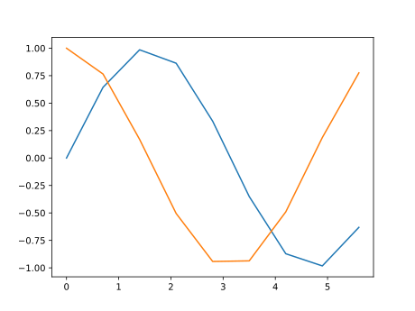

```2024-12-24```

---

## 基础
导入库
```python linenums="1"
import numpy as np
import matplotlib.pyplot as plt
```
画图
=== "代码"
    ```python linenums="1"
    #绘图数据
    x = np.arange(0, 2*np.pi, 0.7)
    y1 = np.sin(x)
    y2 = np.cos(x)
    #绘直线
    plt.plot(x, y1)
    plt.plot(x, y2)
    #绘散点图
    plt.scatter(x, y1)
    plt.scatter(x, y2)
    #或者也可以
    #plt.plot(x, y1,'.-')

    plt.show()#显示图片
    ```
=== "效果"
    

## 保存图片
可以通过format选择图片格式。
```python linenums="1"
plt.savefig('1.svg', format='svg')
```
## 设置图例
## 设置坐标样式
## 设置坐标刻度
