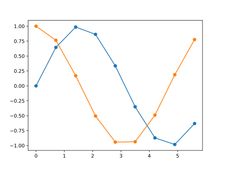

```2024-12-24```

---

## 基础
导入库
```python linenums="1"
import numpy as np
import matplotlib.pyplot as plt
```
画图

=== "代码"
    ```python linenums="1"
    import numpy as np
    import matplotlib.pyplot as plt
    #绘图数据
    x = np.arange(0, 2*np.pi, 0.7)
    y1 = np.sin(x)
    y2 = np.cos(x)
    #绘直线
    plt.plot(x, y1)
    plt.plot(x, y2)
    #绘散点图
    plt.scatter(x, y1)
    plt.scatter(x, y2)
    #或者也可以
    #plt.plot(x, y1,'.-')

    plt.show()#显示图片
    ```
=== "图片"
    

保存图片,可以通过format选择图片格式。
```python linenums="1"
plt.savefig('1.svg', format='svg')
```
设置字体英文为Times New Roman，中文为宋体。
```python linenums="1"
plt.rcParams['font.family']=' Times New Roman, Songti SC'
#Mac系统下宋体是Sonti SC，Windows下可能是SimSun
```
设置窗口大小
```python linenums="1"
plt.rcParams['figure.figsize'] = (8, 5)
```
## 设置图例
=== "代码"
    ```python linenums="1" hl_lines="17 18 19 20 21"
    import numpy as np
    import matplotlib.pyplot as plt

    #设置字体
    #Mac系统下宋体是Sonti SC，Windows下可能是SimSun
    plt.rcParams['font.family']=' Times New Roman, Songti SC'
    #设置窗口大小
    plt.rcParams['figure.figsize'] = (8, 5)
    #绘图数据
    x = np.arange(0, 2*np.pi, 0.7)
    y1 = np.sin(x)
    y2 = np.cos(x)
    #绘图
    plt.plot(x, y1, 's-',label='y = sin(x)', color='r')
    plt.plot(x, y2, '^-',label='y = cos(x)', color='b')

    #设置图例
    #设置标题，字号，加粗
    plt.title('title', fontsize=14, fontweight='bold')
    #设置图例位置，字号，隐藏边框
    plt.legend(loc='best',fontsize=16, frameon=False)

    #保存图片
    plt.savefig('2.svg', format='svg')
    #显示图片
    plt.show()
    ```
=== "图片"
    
## 设置坐标样式
=== "代码"
    ```python linenums="1" hl_lines="23 24 25 26 27 28 29 30 31 32 33 34 35 36 37 38 39 40"
    import numpy as np
    import matplotlib.pyplot as plt

    #设置字体
    #Mac系统下宋体是Sonti SC，Windows下可能是SimSun
    plt.rcParams['font.family']=' Times New Roman, Songti SC'
    #设置窗口大小
    plt.rcParams['figure.figsize'] = (8, 5)
    #绘图数据
    x = np.arange(0, 2*np.pi, 0.7)
    y1 = np.sin(x)
    y2 = np.cos(x)
    #绘图
    plt.plot(x, y1, 's-',label='y = sin(x)', color='r')
    plt.plot(x, y2, '^-',label='y = cos(x)', color='b')

    #设置图例
    #设置标题，字号，加粗
    plt.title('title', fontsize=14, fontweight='bold')
    #设置图例位置，字号，隐藏边框
    plt.legend(loc='best',fontsize=16, frameon=False)

    #设置坐标轴样式
    #设置坐标轴刻度朝内
    plt.rcParams['xtick.direction'] = 'in'
    plt.rcParams['ytick.direction'] = 'in'
    #设置轴变量名，及字号
    plt.xlabel("x-axis", fontsize=14)
    plt.ylabel("y-axis", fontsize=14)
    #设置坐标轴数字字号
    plt.yticks(fontsize=14)
    plt.xticks(fontsize=14)
    ax = plt.gca()
    #设置轴线宽
    ax.spines['bottom'].set_linewidth(1)
    ax.spines['left'].set_linewidth(1)
    ax.spines['right'].set_linewidth(1)
    ax.spines['top'].set_linewidth(1)
    #设置左右两y轴
    ax.twinx().yaxis.set_ticklabels([])

    #保存图片
    plt.savefig('4.svg', format='svg')
    #显示图片
    plt.show()
    ```
=== "图片"
    

## 设置坐标刻度
=== "代码"
    ```python linenums="1" hl_lines="41 42 43 44 45 46 47 48 49"
    import numpy as np
    import matplotlib.pyplot as plt

    #设置字体
    #Mac系统下宋体是Sonti SC，Windows下可能是SimSun
    plt.rcParams['font.family']=' Times New Roman, Songti SC'
    #设置窗口大小
    plt.rcParams['figure.figsize'] = (8, 5)
    #绘图数据
    x = np.arange(0, 2*np.pi, 0.7)
    y1 = np.sin(x)
    y2 = np.cos(x)
    #绘图
    plt.plot(x, y1, 's-',label='y = sin(x)', color='r')
    plt.plot(x, y2, '^-',label='y = cos(x)', color='b')

    #设置图例
    #设置标题，字号，加粗
    plt.title('title', fontsize=14, fontweight='bold')
    #设置图例位置，字号，隐藏边框
    plt.legend(loc='best',fontsize=16, frameon=False)

    #设置坐标轴样式
    #设置坐标轴刻度朝内
    plt.rcParams['xtick.direction'] = 'in'
    plt.rcParams['ytick.direction'] = 'in'
    #设置轴变量名，及字号
    plt.xlabel("x-axis", fontsize=14)
    plt.ylabel("y-axis", fontsize=14)
    #设置坐标轴数字字号
    plt.yticks(fontsize=14)
    plt.xticks(fontsize=14)
    ax = plt.gca()
    #设置轴线宽
    ax.spines['bottom'].set_linewidth(1)
    ax.spines['left'].set_linewidth(1)
    ax.spines['right'].set_linewidth(1)
    ax.spines['top'].set_linewidth(1)


    #设置坐标刻度
    #设置y轴每0.5一刻度
    y_m_l = plt.MultipleLocator(0.5)
    ax.yaxis.set_major_locator(y_m_l)
    #设置y轴科学记数法
    plt.ticklabel_format(axis='x', style='sci', scilimits=(0, 0))
    #设置范围
    #plt.xlim(0, 5)
    #plt.ylim(-1, 1)

    #设置左右两y轴 右侧数字隐藏
    #该行代码最好放最后，以免与前y轴设置冲突
    ax.twinx().yaxis.set_ticklabels([])

    #保存图片
    plt.savefig('4.svg', format='svg')
    #显示图片
    plt.show()
    ```
=== "图片"
    
